# EuroTrans

[](https://www.youtube.com/watch?v=YOUTUBE_VIDEO_ID)

**Walkthrough video:**  
`https://www.youtube.com/watch?v=YOUTUBE_VIDEO_ID`

EuroTrans is a full-stack logistics platform for shipment operations, driver workflows, fleet management, and live shipment tracking.

## Quick View
- Frontend (prod): `https://eurotrans.vercel.app`
- Backend base URL (prod): set by your deployment target
- Health checks: `/health/live`, `/health/ready`
- API versioning: `?api-version=1.0` or header `x-api-version: 1.0`
- Architecture style: Clean Architecture + Vertical Slice (backend)
- Stack: Next.js 16 + ASP.NET Core 8 + PostgreSQL + Auth0 + Azure Blob

## Table of Contents
- [Product Overview](#product-overview)
- [Core Features](#core-features)
- [Tech Stack](#tech-stack)
- [Repository Structure](#repository-structure)
- [Software Architecture Design](#software-architecture-design)
- [Database Design](#database-design)
- [API Endpoints](#api-endpoints)
- [Shipment Lifecycle and Business Rules](#shipment-lifecycle-and-business-rules)
- [UI Screenshots](#ui-screenshots)
- [Local Setup](#local-setup)
- [Environment Variables](#environment-variables)
- [Testing](#testing)
- [Observability and Operations](#observability-and-operations)
- [CI/CD](#cicd)
- [Portfolio Notes](#portfolio-notes)

## Product Overview
EuroTrans models two operational personas:
- **Manager**: create and assign shipments, manage fleet and employees, monitor map and analytics, access documents.
- **Driver**: complete profile, start transit, send location updates and milestones, upload proof of delivery.

The backend is designed with Clean Architecture boundaries and vertical slices per feature, with API versioning, rate limiting, global exception handling, health checks, and structured logging.

## Core Features
- Shipment lifecycle: create, assign, start, heartbeat tracking, milestone logging, deliver, cancel
- Role-based access using Auth0 RBAC permissions
- Driver and truck management with status workflows
- Live map with stale marker behavior
- Proof-of-delivery upload to Azure Blob Storage
- Pagination on manager and driver listing screens
- Caching for read-heavy endpoints

## Tech Stack
- Frontend: Next.js 16, React 19, TypeScript, Tailwind CSS, TanStack Query
- Backend: ASP.NET Core 8 (Minimal APIs), EF Core 8, PostgreSQL
- Auth: Auth0 (`@auth0/nextjs-auth0` + JWT API auth)
- Storage: Azure Blob Storage
- CI/CD: GitHub Actions, Vercel (client), Azure App Service (server)

## Repository Structure
- `eurotrans.client` - Next.js app
- `eurotrans.server/src/EuroTrans.Api` - API host, middleware, endpoint registration
- `eurotrans.server/src/EuroTrans.Application` - use cases, validators, service abstractions
- `eurotrans.server/src/EuroTrans.Domain` - entities and core business rules
- `eurotrans.server/src/EuroTrans.Infrastructure` - EF Core, repositories, external services
- `eurotrans.server/src/EuroTrans.Test` - domain/application/integration tests
- `docs/portfolio` - architecture, DB, and screenshot assets for portfolio presentation

## Software Architecture Design
### System Context
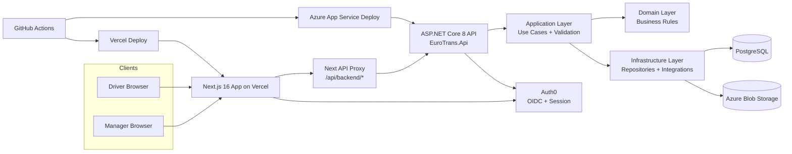

### Backend Clean Architecture + Vertical Slice
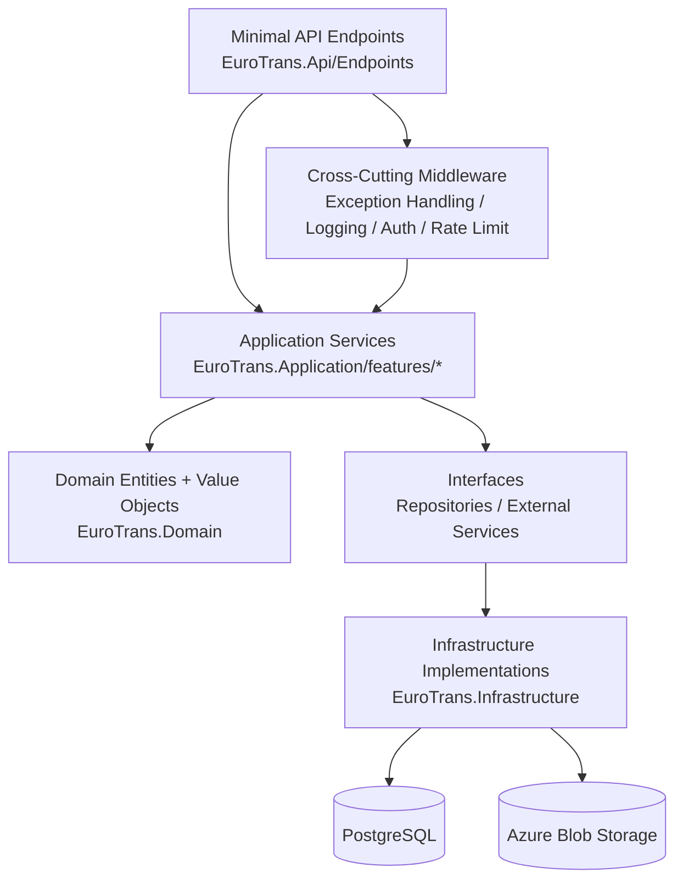

Detailed architecture docs:
- `docs/portfolio/architecture/system-architecture.md`
- `docs/portfolio/architecture/backend-clean-architecture.md`
- `docs/portfolio/architecture/shipment-sequence.md`

## Database Design
Current persistence uses PostgreSQL with EF Core migrations.

### Core Entities
- `employees` - identity-linked manager/driver data and profile state
- `drivers` - driver operational state (`available`, `on-duty`, `off-duty`)
- `trucks` - fleet records and status (`available`, `in-use`, `maintenance`)
- `shipments` - shipment aggregate root and lifecycle state
- `shipment_activities` - timeline audit entries
- `shipment_milestones` - operational route/milestone events
- `shipment_tracking_points` - heartbeat location points

### Entity Relationship Diagram
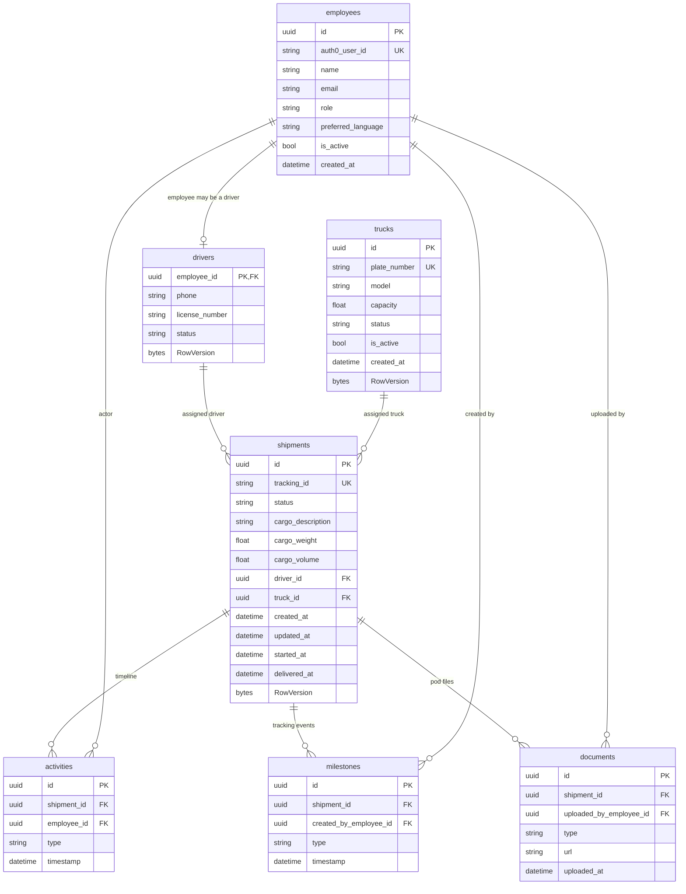


## API Endpoints
Base version: `v1.0` (`api-version` query or `x-api-version` header)

### Auth and User
| Method | Route | Access | Purpose |
|---|---|---|---|
| GET | `/api/auth/me` | Authenticated | Current user context |
| PUT | `/api/auth/me/language` | Authenticated | Update preferred language |
| POST | `/api/auth/sync-user` | `sync:users` | Sync Auth0 user into app domain |

### Shipments
| Method | Route | Access | Purpose |
|---|---|---|---|
| GET | `/api/shipments` | `read:shipments` | Paginated shipment list |
| GET | `/api/shipments/{id}` | `read:shipments` | Shipment details |
| POST | `/api/shipments` | Manager + `write:shipments` | Create shipment |
| POST | `/api/shipments/{id}/assign` | Manager + `write:shipments` | Assign driver and truck |
| POST | `/api/shipments/{id}/start` | Driver + `write:shipments` | Start transit |
| POST | `/api/shipments/{id}/deliver` | Driver + `write:shipments` | Upload POD and deliver |
| POST | `/api/shipments/{id}/cancel` | Manager + `write:shipments` | Cancel shipment |
| GET | `/api/shipments/{id}/activities` | `read:shipments` | Shipment timeline |
| POST | `/api/shipments/{id}/milestones` | Driver + `write:shipments` | Add milestone |
| POST | `/api/shipments/{id}/tracking/heartbeat` | Driver + `write:shipments` | Send location heartbeat |
| GET | `/api/shipments/live-pins` | `read:shipments` | Paginated live map pins |
| GET | `/api/drivers/me/current-shipment` | `read:shipments` | Driver active shipment |

### Fleet (Trucks)
| Method | Route | Access | Purpose |
|---|---|---|---|
| GET | `/api/trucks` | Manager + `read:trucks` | Paginated truck list |
| GET | `/api/trucks/{id}` | Manager + `read:trucks` | Truck details |
| GET | `/api/trucks/options` | Manager + `read:trucks` | Assignment dropdown options |
| POST | `/api/trucks` | Manager + `write:trucks` | Create truck |
| PUT | `/api/trucks/{id}/status` | Manager + `write:trucks` | Update truck status |
| DELETE | `/api/trucks/{id}` | Manager + `write:trucks` | Delete truck |

### Employees (Drivers)
| Method | Route | Access | Purpose |
|---|---|---|---|
| GET | `/api/drivers` | Manager + `read:employees` | Paginated driver list |
| GET | `/api/drivers/{id}` | Manager + `read:employees` | Driver details |
| GET | `/api/drivers/options` | Manager + `read:employees` | Assignment dropdown options |
| PUT | `/api/drivers/{id}/status` | Manager + `write:employees` | Update driver status |
| PUT | `/api/drivers/me/profile` | Driver + `sync:users` | Complete/update driver profile |

### Analytics and Health
| Method | Route | Access | Purpose |
|---|---|---|---|
| GET | `/api/analytics/overview` | Manager | KPI and chart data |
| GET | `/health/live` | Anonymous | Liveness check |
| GET | `/health/ready` | Anonymous | Readiness check |

## Shipment Lifecycle and Business Rules
### Lifecycle
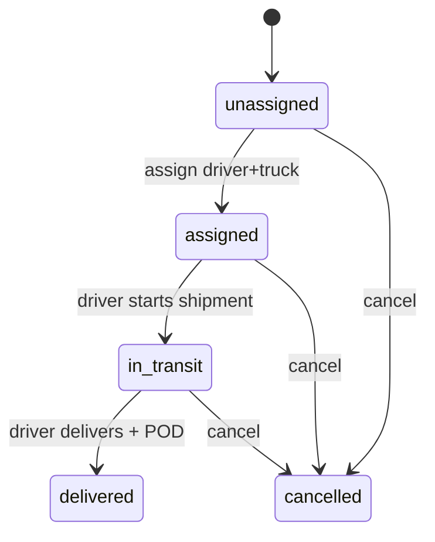

### Operational Sequence
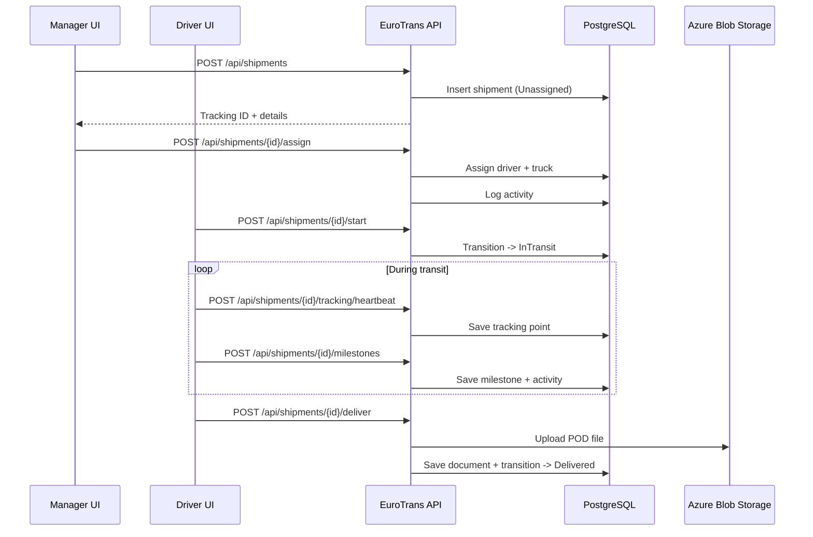

### Rule Summary
- Only managers can create, assign, and cancel shipments.
- Driver must have a completed profile before normal driver workflow access.
- Driver can start only assigned shipments.
- Delivery requires proof of delivery upload.
- Tracking heartbeats are accepted for in-transit shipments.
- Truck/driver statuses are constrained by active-assignment rules.

## UI Screenshots
### Manager UI
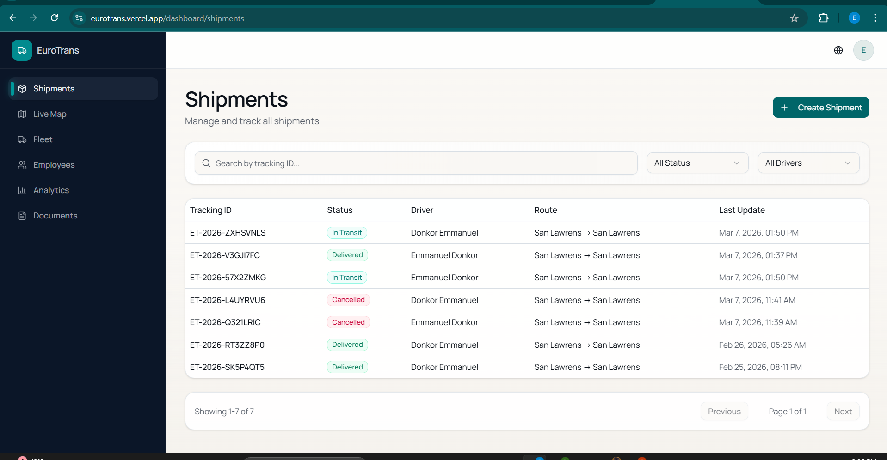
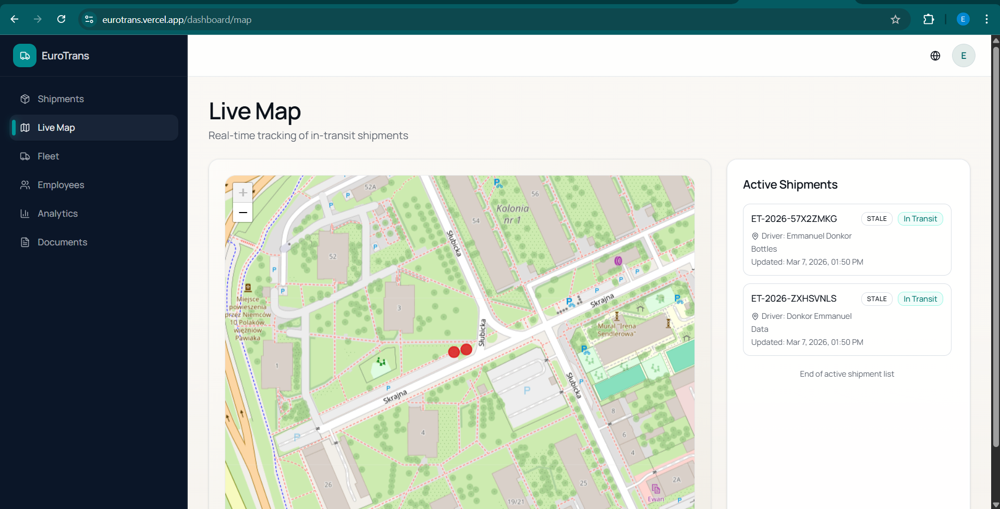

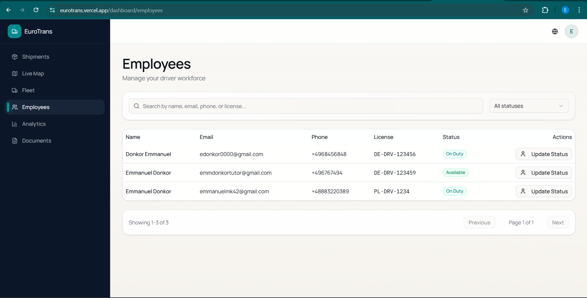
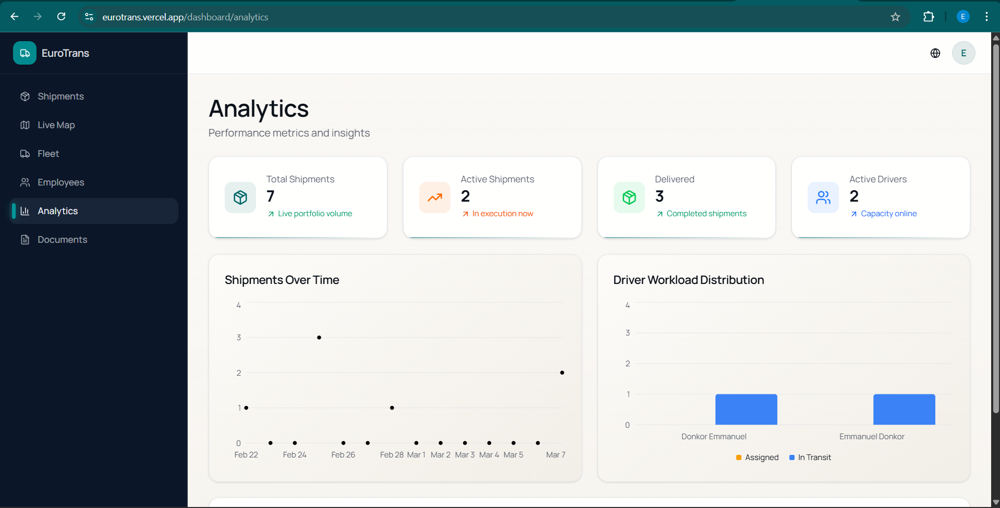


### Driver UI
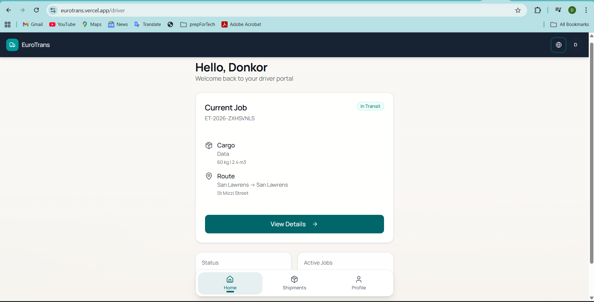
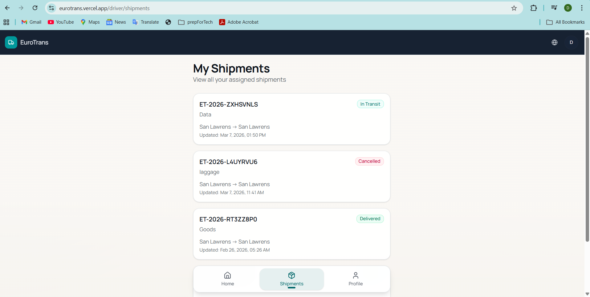
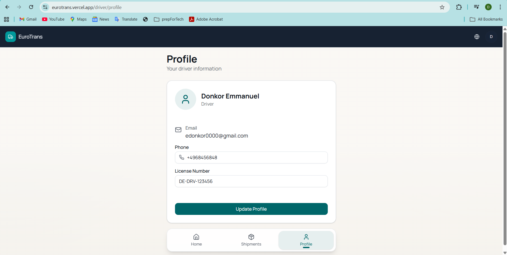
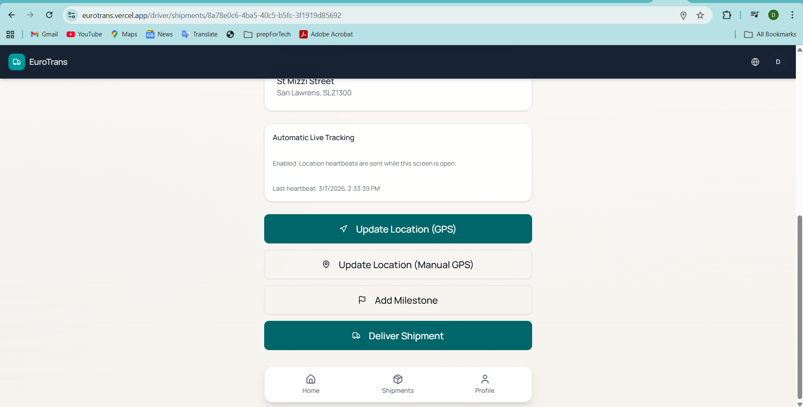

## Local Setup
### Prerequisites
- Node.js `>= 20.9.0`
- pnpm `>= 10`
- .NET SDK 8.x
- PostgreSQL
- Auth0 tenant (API + application)
- Azure Blob Storage account and container

### 1) Copy environment examples
```powershell
Copy-Item eurotrans.client/.env.example eurotrans.client/.env.local
Copy-Item eurotrans.server/.env.example eurotrans.server/.env.local
```

### 2) Fill real values in env files
- `eurotrans.client/.env.local`
- `eurotrans.server/.env.local` (or user secrets)

### 3) Apply migrations
```powershell
dotnet tool install --global dotnet-ef
dotnet ef database update --project eurotrans.server/src/EuroTrans.Infrastructure/EuroTrans.Infrastructure.csproj --startup-project eurotrans.server/src/EuroTrans.Api/EuroTrans.Api.csproj
```

### 4) Start backend
```powershell
cd eurotrans.server
dotnet restore EuroTrans.sln
dotnet run --project src/EuroTrans.Api/EuroTrans.Api.csproj
```

### 5) Start frontend
```powershell
cd eurotrans.client
pnpm install
pnpm dev
```

### 6) Open locally
- Frontend: `http://localhost:3000`
- API: `http://localhost:5002`
- Swagger (development only): `http://localhost:5002/swagger`

## Environment Variables
Source of truth:
- `eurotrans.client/.env.example`
- `eurotrans.server/.env.example`

Key groups:
- Client/Auth0: `AUTH0_*`, `APP_BASE_URL`
- Client proxy: `EUROTRANS_API_BASE_URL`
- Server DB: `ConnectionStrings__Default`
- Server Auth0: `Auth0__Domain`, `Auth0__Audience`
- Server CORS: `Cors__AllowedOrigins__*`
- Server storage: `AzureStorage__ConnectionString`, `AzureStorage__Container`

## Testing
Backend tests:
```powershell
dotnet test eurotrans.server/EuroTrans.sln --configuration Release
```

Frontend quality check:
```powershell
pnpm --dir eurotrans.client lint
```

## Observability and Operations
- Health endpoints:
  - `/health/live`
  - `/health/ready`
- Logging:
  - Structured logs via `ILogger` with correlation IDs in error responses
  - Local: console output from `dotnet run`
  - Azure: App Service log stream (if enabled)
- Error handling:
  - Global exception middleware returns safe ProblemDetails

## CI/CD
Workflows:
- Client: `.github/workflows/client-cd.yml`
- Server: `.github/workflows/server-cd.yml`

Required secrets:
- Client: `VERCEL_TOKEN`, `VERCEL_ORG_ID`, `VERCEL_PROJECT_ID`
- Server: `PROD_DB_CONNECTION_STRING`, `AZUREAPPSERVICE_PUBLISHPROFILE_5EEA8F3C1C964300BE898AC8B6FEEA84`

## Notes
If you are reviewing this project, start with:
- `eurotrans.server/src/EuroTrans.Api/Program.cs`
- `eurotrans.server/src/EuroTrans.Application`
- `eurotrans.server/src/EuroTrans.Domain`
- `eurotrans.server/src/EuroTrans.Infrastructure`
- `eurotrans.server/src/EuroTrans.Test`

Then open the UI flows:
- Manager: shipments, live map, fleet, analytics, documents
- Driver: profile completion, current shipment, milestone updates, delivery flow
