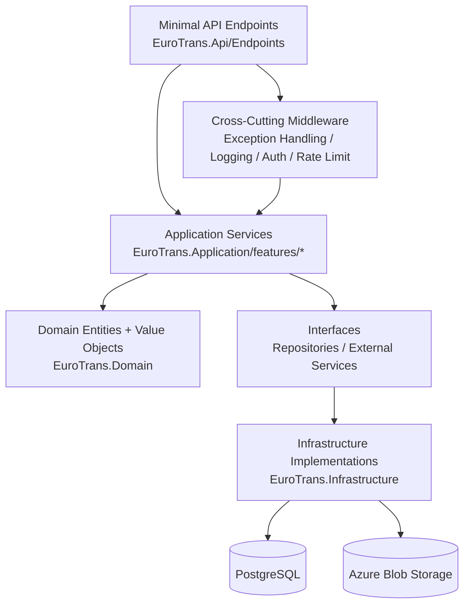

# Backend Clean Architecture (Vertical Slice)

## Why this structure matters
- Endpoints stay thin and orchestrate use cases.
- Business logic lives in services/domain model, not repository/query plumbing.
- Infrastructure can be swapped without changing business rules.
