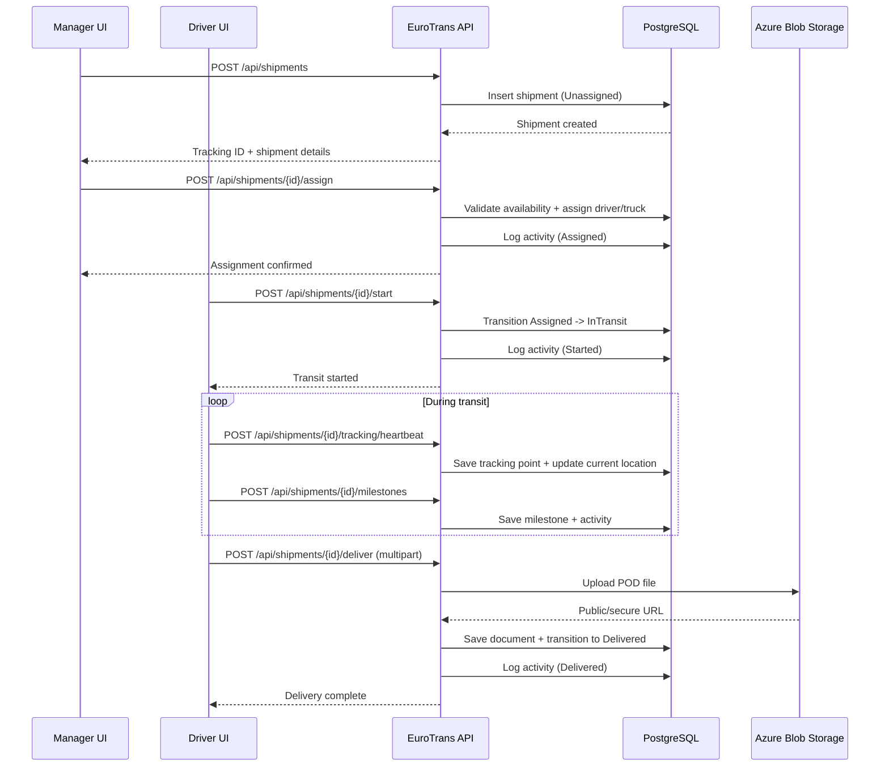

# Shipment Lifecycle Sequence

```mermaid
sequenceDiagram
    participant Manager as Manager UI
    participant Driver as Driver UI
    participant API as EuroTrans API
    participant DB as PostgreSQL
    participant Blob as Azure Blob Storage

    Manager->>API: POST /api/shipments
    API->>DB: Insert shipment (Unassigned)
    DB-->>API: Shipment created
    API-->>Manager: Tracking ID + shipment details

    Manager->>API: POST /api/shipments/{id}/assign
    API->>DB: Validate availability + assign driver/truck
    API->>DB: Log activity (Assigned)
    API-->>Manager: Assignment confirmed

    Driver->>API: POST /api/shipments/{id}/start
    API->>DB: Transition Assigned -> InTransit
    API->>DB: Log activity (Started)
    API-->>Driver: Transit started

    loop During transit
        Driver->>API: POST /api/shipments/{id}/tracking/heartbeat
        API->>DB: Save tracking point + update current location
        Driver->>API: POST /api/shipments/{id}/milestones
        API->>DB: Save milestone + activity
    end

    Driver->>API: POST /api/shipments/{id}/deliver (multipart)
    API->>Blob: Upload POD file
    Blob-->>API: Public/secure URL
    API->>DB: Save document + transition to Delivered
    API->>DB: Log activity (Delivered)
    API-->>Driver: Delivery complete
```
