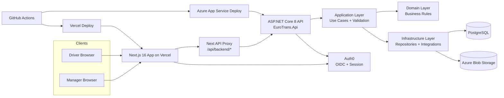

# System Architecture

## Notes
- Frontend calls backend through the Next.js proxy route (`/api/backend/*`).
- API uses JWT validation + RBAC policies.
- Domain and business invariants are enforced in application/domain layers, not controllers.
