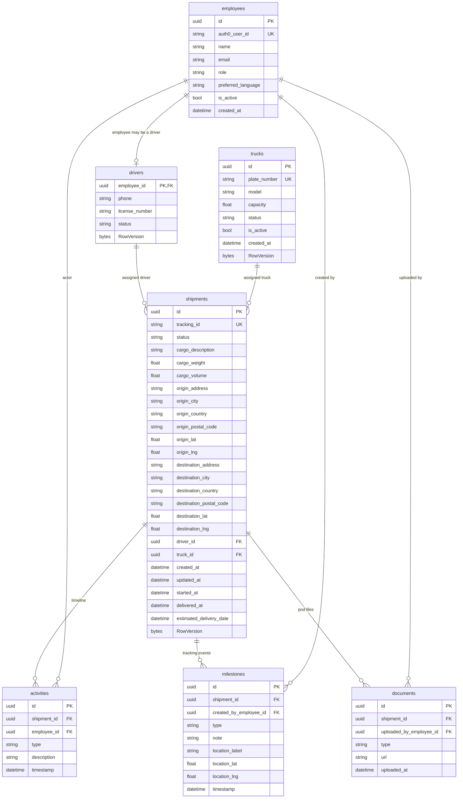

# Database ERD (PostgreSQL)

## Notes
- `shipments.driver_id` and `shipments.truck_id` each have a partial unique index for active states (`Assigned`, `InTransit`) to prevent double allocation.
- `drivers.employee_id` is a shared key one-to-one with `employees.id`.
